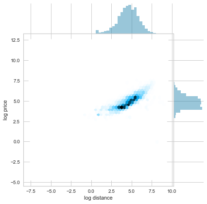
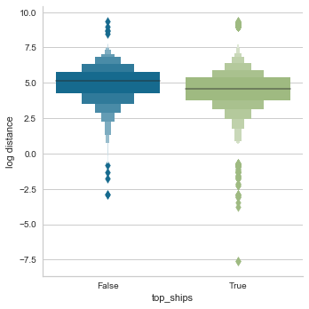
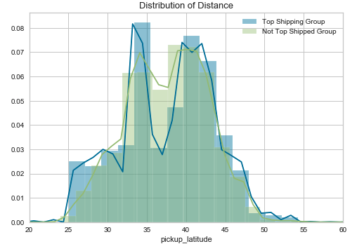
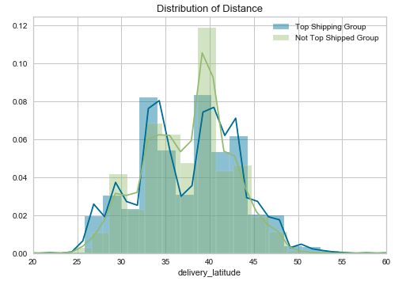
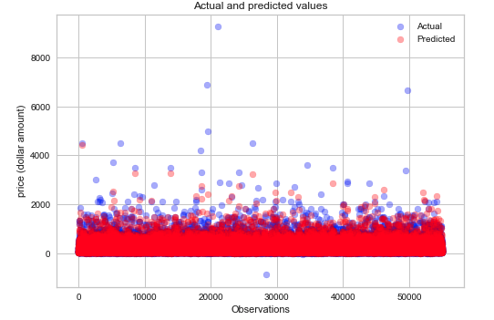

# Predicting Truck Freight Transport in the Heartland: A Data Science Project from Model to Deployment
## Capstone Project: Flatiron School Data Science Bootcamp

### Conducted by: Kevin McPherson | Submitted on July 23, 2020 | Presented on July 24, 2020

## Abstract

Due to it's central location in the United States, Kansas City, Missouri is
a prime location for not only distribution centers but the freight car industry. It is estimated that because of its location, 85 percent of the US population could be reached within two days of shipping and freight logistics. It is predicted that between 2016 and 2027, the shipping by truck industry will grow by 27 percent; that's growth from an already staggering $796.7 billion total revenue industry (Statista, 2018). As such, the industry demands a smarter solution to price trips before they happen, so that less operational costs can be spent on coordination of resources and more money can be put to the salaries of drivers and truck maintenance. Thus, in this capstone project, I will introduce a machine learning model that predicts shipping prices on a smaller attainable market: that of the $12 billion per year vehicle shipping services. My goal is to present both supervised (multiple linear regression), unsupervised (clustering), and ensemble (random forest regressor) learning models and deploy one of them to a requestable API used the FastAPI and Cortex technologies, which have been recently developed. 

---

## Some Notes Before We Proceed

* This work was done simulataneously as a work project for my career at a small startup in Kansas City called Bellwethr for another small startup in  the freight space called SuperDispatch. 
* In the project, you may see some acronyms like sd (SuperDispatch) to signify various variables and file assignments
* The data will be hidden from plain view and added to a .gitignore folder as it is proprietary and I did not previously go through the correct channels to have it shown on this repository

---

## Project Outline (What's Here)

The project consists of three different levels or directories:

**1. The API** <br>
This is where the API, which is tested locally via FastAPI and deployed on a staging cluster via Cortex, is stored. It is part of a larger repo that is maintained at my current job (Bellwethr), which is private and only viewable to me and the rest of the team. During my presentation, I intend to take whoever is interested through this private repo, and it is added as a submodule here. 

- The API also formalizes a process for the team to deploy a larger MLOps strategy. It utilizes the `poetry` installation module as well as writes a variety of config files that interact with AWS S3 resources that store the model and toml files that orchestrate various environment variables that work in symphony. More on this another time. 

- The idea for the API is simple: the client (a small startup called SuperDispatch) wants to use this API to quickly estimate transportation costs for customers who use their CarrierTMS or ShipperTMS software.The CarrierTMS software gives freight companies the opportunity to price out their various shipping needs while the ShipperTMS software allows merchandise owners (car dealerships, independent owners) the ability to estimate logistics costs. Currently, according to another company called Backlot Cars, this process is time-consuming and overly engineered, running through 4 different teams and spreading geographically, making pricing options costly, temporally long, and just plain headache-y. 

**2. The Notebooks** <br>
This is where I conducted all my experiments and constructed a baseline model. In theory, data science should be conducted as not knowing the inputs; however, due the requests of SuperDispatch, these were pre-determined. 

**3. The Data** <br>
This is where I decided to keep the various things saved from the notebook. In this case, the classes that were encoded by `LabelEncoder` are kept here. In the future, this is where the model that is pickled, `model.pkl` will be stored. The data provided by SuperDispatch will not be present here because it is proprietary.

**4. The Images** <br>
This is where all the images output from the notebook are maintained. Some have code outputs like `distplot.savefig('image.png)` and others were screenshot and added to the directory.

---

## Materials (i.e., Libraries and Technologies) and Methods Used

The following methods and materials were used in this project, including a brief list of the dependencies for the notebook, specifically.

- For *the data science* I used the *OSEMN Method* and it is outlined in the notebook accordingly

- For the *machine learning* I used the `sklearn` library and specifically the `RandomForestRegressor`, `LinearRegression`, and `RidgeRegressor` submodules

- The dependencies for these two sections are:
   
    > import pandas as pd # For data manipulation <br>
    > import numpy as np # For statistics, file compression <br>
    > import missingno as msno # For visualization of data completeness <br>
    > import matplotlib.pyplot as plt <br>
    > import seaborn as sns <br>
    > from geopy import distance <br>
    > from sklearn.preprocessing import StandardScaler <br>
    > from sklearn.cluster import KMeans <br>
    > from sklearn.manifold import TSNE <br>
    > from sklearn.metrics import silhouette_score <br>
    > from yellowbrick.cluster import KElbowVisualizer <br>
    > from sklearn.model_selection import cross_val_score, GridSearchCV <br>
    > from sklearn.ensemble import RandomForestRegressor <br>
    > from sklearn.preprocessing import MinMaxScaler <br>
    > from sklearn.model_selection import train_test_split <br>
    > from sklearn.metrics import mean_absolute_error <br>
    > from sklearn.metrics import mean_squared_error <br>
    > import scipy.stats as stats <br>
    > from sklearn.preprocessing import LabelEncoder <br>
    > from sklearn.linear_model import LinearRegression <br>
    > from sklearn.linear_model import Ridge <br>
    > from sklearn.metrics import mean_squared_error <br>
    > import pickle <br>

- For the *MLOps and productionization of the model* I used [FastAPI](https://fastapi.tiangolo.com/) for local deployment to test originally. I then switched to [Cortex](cortex.dev). Cortex utilizes AWS, so I have made various config files and `.env` files that hold my company's credentials to sign on to AWS and access things like S3.

- The dependencies for the API are:

    > boto3==1.14.20 <br>
    > botocore==1.17.20 <br>
    > click==7.1.2 <br>
    > dataclasses==0.6; python_version < "3.7" <br>
    > docutils==0.15.2 <br>
    > fastapi==0.59.0 <br>
    > geographiclib==1.50 <br>
    > geopy==2.0.0 <br>
    > h11==0.9.0 <br>
    > httptools==0.1.1; sys_platform != "win32" and sys_platform != "cygwin" and platform_python_implementation != "PyPy" <br>
    > jmespath==0.10.0 <br>
    > joblib==0.16.0 <br>
    > numpy==1.19.0 <br>
    > pandas==1.0.5 <br>
    > pydantic==1.6 <br>
    > python-dateutil==2.8.1 <br>
    > python-dotenv==0.14.0 <br>
    > pytz==2020.1 <br>
    > s3transfer==0.3.3 <br>
    > scikit-learn==0.23.1 <br>
    > scipy==1.5.1 <br>
    > six==1.15.0 <br> 
    > starlette==0.13.4 <br>
    > threadpoolctl==2.1.0 <br> 
    > urllib3==1.25.9; python_version != "3.4" <br>
    > uvicorn==0.11.5 <br>
    > uvloop==0.14.0; sys_platform != "win32" and sys_platform != "cygwin" and platform_python_implementation != "PyPy" <br>
    > websockets==8.1 <br>

    ---

## Results of the Project

### Data Exploration and Some Visualizations

 

**Various conclusions were reached while exploring the data, including:**

- The high density of price range is from 4.4816890703380645 to 148.4131591025766 dollars
- The high density distance range is from 13.463738035001692 to 403.4287934927351 miles
- The mean distance of vehicles not in the top five of shipped vehicle types is 281.31058244911173 miles
- The mean distance of vehicles not in the top five of shipped vehicle types is 198.11402065754618 miles
    - These are statistically significantly different based on a t-test
- More pickups happen in the 35-40 latitude area in the `not top shipped group` as compared to the `top shipped group` of vehicles
- More deliveries happen in the 37.5-40 latitude area in the `not top shipped group` as compared to the `top shipped group` of vehicles

 

For more visualizations, please see the `notebook` directory.

The rest of the repo is dedicated to the API. The API is built and accessed via a staging URL. If you put in a request dictionary like:

```json
{
	"pickup_latitude": 36.130518,
	"pickup_longitude": -115.085227,
	"delivery_latitude": 41.845691,
	"delivery_longitude": -87.678616,
	"vehicle_year": 2015,
	"vehicle_type": "sedan",
	"is_inoperable": true
}
```
The response should be as follows, with various permutations of `vehicle_type` and `is_inoperable`:

```json
{
    "predictions": [
        {
            "vehicle_type": "suv",
            "is_inoperable": true,
            "prediction": 929.15
        },
        {
            "vehicle_type": "suv",
            "is_inoperable": false,
            "prediction": 929.15
        },
        {
            "vehicle_type": "sedan",
            "is_inoperable": true,
            "prediction": 929.15
        },
        {
            "vehicle_type": "sedan",
            "is_inoperable": false,
            "prediction": 929.15
        },
        {
            "vehicle_type": "4_door_pickup",
            "is_inoperable": true,
            "prediction": 929.15
        }
```
And on and on...

---

## Conclusions and Business Recommendations

From our preceding work, we have found that the pre-selection of features really constrains our modeling. However, we were able to find some very interesting business-related conclusions from the data. They are as follows:

1. The list of top 5 most shipped vehicle types is 'sedan', 'suv', '4_door_pickup', 'other', and 'van'. These vehicles are shipped in a range less than all other vehicles. This is almost 100 miles less on average than other vehicles, and it is statistically significant after a student's t-test. Therefore, Kansas City companies should focus their markets on these vehicle types on on trips centering around 200 miles as the mean. 
2. Going back to the the top shipped vehicles, most are picked up or dropped off in the 35-40th parallel (on average), thus Kansas City shipping companies can also augment their markets to look for vehicles shipped to and from Kansas and Nebraska. 
3. The RF Regressor model is currently the best model to put into production to figure out trip price for all vehicle types, but there is worry that it might be underfit.



The future of this work includes the following bullet points:
- Work towards a better model to put into production on the API. Previously I have tried to do clustering on the types of trips that may exist in the data, but with no luck, so I will look at other ensemble models to test. One that seems particularly interesting, if I can get the computer power to work is [mlxtend's StackingRegressor](https://rasbt.github.io/mlxtend/user_guide/regressor/StackingRegressor/).


